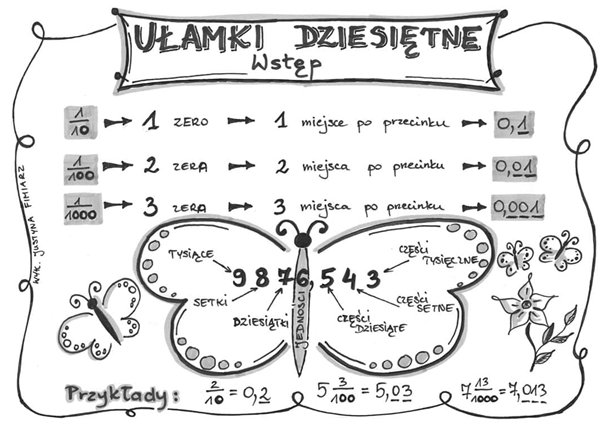
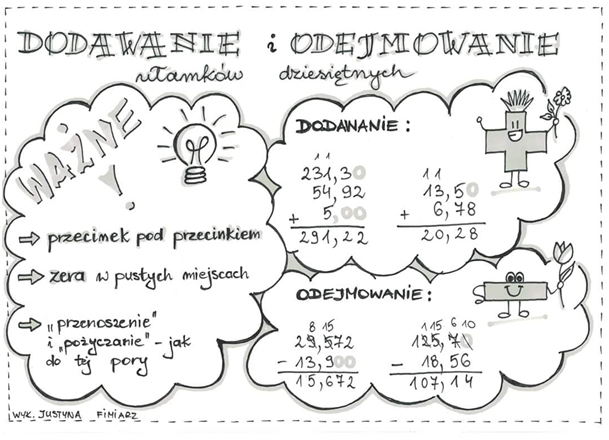
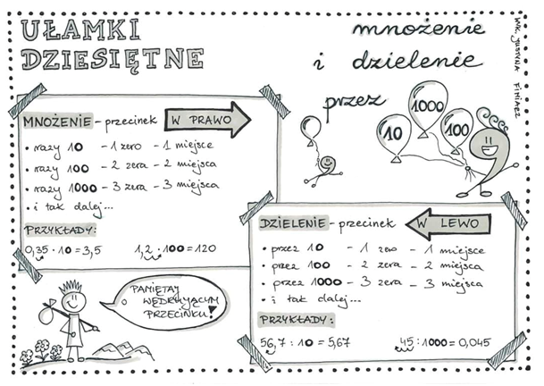
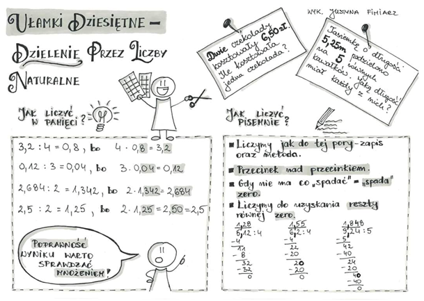

# Ułamki dziesiętne
Ułamek zwykły, gdzie w mianowniku jest wielokrotność 10. Reprezentujemy przy użyciu  `,` zamiast kreski ułamkowej. Rolę kreski ułamkowej pełni `,`, cyfry po lewej stronie przecinka stanowią liczbę całości, natomiast po prawej reprezentują licznik mianownika.



### Dodawanie ułamków dziesiętnych
Dodajemy w słupu, tak jak dodawaliśmy liczby naturalne. Należy jedynie pamiętać o dwóch zasadach:

```
1. Przecinki muszą być pod sobą 
2. Puste miejsca wypełniamy zerami
```



### Mnożenie i dzielenie ułamków dziesiętnych przez wieloktroność 10
Mnożymy w słupu, tak jak mnożyliśmy liczby naturalne. Należy jedynie pamiętać o trzech rzeczach:

```
1. W którą stronę przesuwamy przecinek? 
2. O ile miejc przesuwamy przecinek?
3. Puste miejsca wypełniamy zerami
```



### Mnożenie ułamków dziesiętnych
Mnożymy w słupu, tak jak mnożyliśmy liczby naturalne. Należy jedynie pamiętać o jednej zasadzie:

```
1. Suma miejsc po przecinku w wyniuku musi być równa sumie miejsc po przecinku w ułamku
```

### Dzielenie ułamków dziesiętnych przez liczby naturalne
Dzielimy w słupu, tak jak dzieliliśmy liczby naturalne. Należy jedynie pamiętać o jednej rzeczy zasadach:

```
1. Przecinek przepisujemy
```




### Ćwiczenia

1. [Podstawy ułamków dziesiętnych](http://sp32.torun.pl/publik/publ04.pdf)
2. [Dodawanie i odejmowanie liczb dziesiętnych](http://sylwiapizunska.cba.pl/wp-content/uploads/2015/07/Karta-pracy-nr-1-dodawanie-i-odejmowanie-liczb-dziesiętnych-klasa-5.pdf)
3. [Dodawanie i odejmowanie liczb dziesiętnych - zadania tekstowe](http://sylwiapizunska.cba.pl/wp-content/uploads/2015/08/Karta-pracy-nr-2-dodawanie-i-odejmowanie-liczb-dziesiętnych-klasa-5.pdf)
4. [Powtórzenie całości](http://sylwiapizunska.cba.pl/wp-content/uploads/2015/07/Karta-pracy-powtórzenie-działań-na-liczbach-dziesiętnych-klasa-4.pdf)
5. [Powtórzenie całości](http://cloud2o.edupage.org/cloud/SPRAWDZIAN_ULAMKI_DZIESIETNE_KLASA_V.pdf?z%3AWS%2BzE41jcwxg1Z1Zo40bKcYCghRx7sM1O7DeQkLSzy%2FqXWpm9mn6%2Ba15zQQFE1Rs)
6. [Test GWO](https://gwo.pl/strefa-ucznia/szkola-podstawowa/matematyka/#klasa-5#ułamki-dziesiętne)


#### Źródła:
1. [https://sp2obornikisl.edupage.org](https://sp2obornikisl.edupage.org)